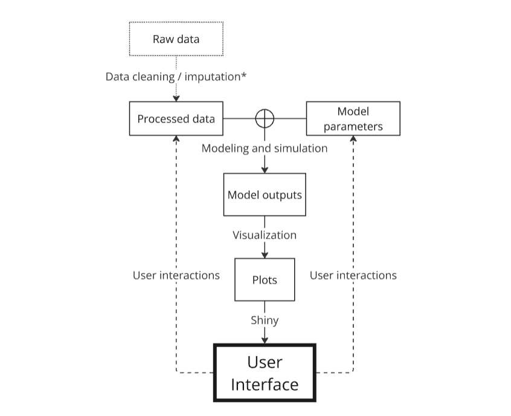

# How is code organized?

The goal of this document is to provide an in-depth description of the 
`{erahumed}` code base. Whether you need to modify the 
package, or simply want to browse through its code (*e.g.* for a qualitative 
check of the correctness of the various algorithms it implements), it is 
fundamental that you understand the various elements that make up this software. 

In order to avoid confusions, let me also clarify what this document is *not*: 

* This is not a user documentation for `{erahumed}`. If you need help using 
the package or simply the DSS dashboard, you should rather consult the official 
documentation: including the package `README`, vignettes, and R documentation 
page accessible through `?` from the R console.
* This is not a scientific presentation of the various algorithms implemented 
by the package, for which you should rather consult ...TODO.... The focus of the 
present document is on the container, not on the content itself.
* This is not a guide to R package or Shiny development. While I've struggled to
make this documentation as self-contained as possible, I need to assume some 
proficiency in these matters from the side of the reader. A few resources that
could help: [R Packages](https://r-pkgs.org/) by Hadley Wickham and Jennifer 
Bryan; the [Shiny Website](https://shiny.posit.co/), which has a lot of 
introductory content; [ChatGPT](https://chatgpt.com/), which can be an extremely 
helpful coding companion for R package development.

## Bird's eye view

The diagram below provides a highly schematic view of the internal data 
processing performed by the various components of the `{erahumed}` R package. 
The main function of `{erahumed}` is to produce the interactive dashboard of the 
[ERAHUMED DSS](https://www.erahumed.com/decision-support-system/), which is 
represented by the "User Interface" block at the bottom of the diagram. The 
remaining solid blocks represent various intermediate outputs, that are supposed 
to be computed in real time while the user is navigating through the 
dashboard, by internal functions of the package. User interactions allow the 
user to tweak the models' inputs, both at the level of data and parameters, 
which explains the necessity of being able to recompute in real time these 
solid blocks.

In contrast to what we just said, the "Raw Data" block on the top of the 
diagram, and its functional connection to the "Processed Data" block (
"data cleaning/imputation") are not required to be computed/executed in real 
time and are relegated to one-time scripts whose execution is left to the 
package developer whenever the data needs to be updated (this is standard 
practice in R package development, see *e.g.* 
[the "Data" chapter](https://r-pkgs.org/data.html) of the "R Packages" online 
book).

## Developer tools and frameworks

The development and testing of the software relies on several external tools and
frameworks, which I list below in approximate order of importance.

* **R packages.** We obviously rely on this general framework, which I 
adopted to make the software easy to deploy and test, mainly. Resources: 
  - [R Packages](https://r-pkgs.org/)
  - [Advanced R](https://adv-r.hadley.nz/)
* **Shiny.** The framework for creating the interactive dashboard. Resources:
  - [The Shiny Website](https://shiny.posit.co/)
* **{testthat} and derivatives.** This R package was used to build the software 
testing infrastructure. Resources:
  - [{testthat} documentation](https://r-pkgs.org/)
* **Git and Github.** For code versioning. Resources:
  - [GitHub official documentation](https://docs.github.com/)
* **Github Actions.** For continuous testing. Resources:
  - [Github official documentation](https://github.com/features/actions)
* **Semantic versioning.** The rationale I used to name software versions. 
Resources:
  - [Semantic Versioning Manifesto](https://semver.org/)

Finally, while this is not really a dependence, if you are going to actively 
work on the code for `{erahumed}` I strongly suggest using RStudio and the 
packages `{devtools}` and `{usethis}`, that automatize a lot of the mechanical 
work required to get an R package working smoothly.

## Folder structure of the repository
