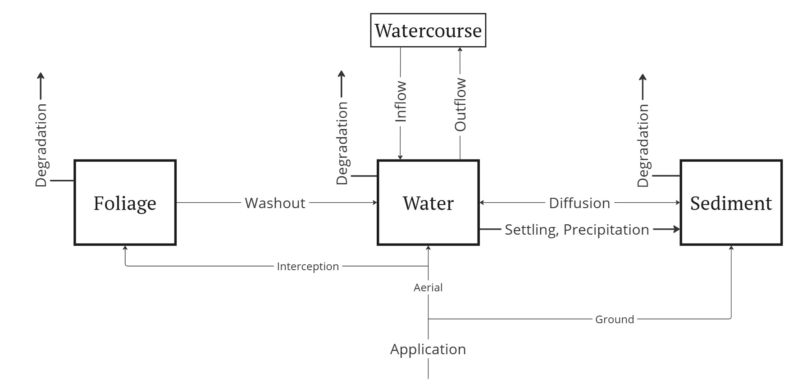

This schematic diagram illustrates the processes captured by our model for chemical transport in rice fields^[Numerical details will be provided elsewhere.]. Directional arrows depict the transfer of matter among the three compartments considered in the model—Foliage, Water, and Soil—as well as exchanges with the external environment via degradation, water inflow/outflow, and direct application.

 
